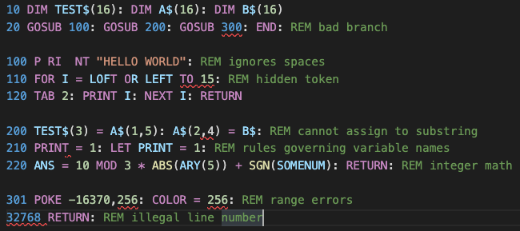

# Integer BASIC

Language support for Integer BASIC in Visual Studio Code.

Latest update: LSP implementation, brings parity with Applesoft extension

* Semantic highlights true to Apple ][ ROM parsing
* Completions and hovers for all statements
* Completions and hovers for soft switches, ROM routines, etc.
* Diagnostics to identify errors and gotchas
* Renumber lines in a selection or full document
* Transfer programs to and from Apple ][ emulators (see below)
* View tokenized program as hex dump and unicode text
* Options : see `Ctrl+Comma` -> `Extensions` -> `Integer BASIC`
* Commands: see `Ctrl+P` -> `integerbasic`
* Activates for file extensions `.bas`, `.ibas`

## Other BASIC extensions

If you use the extension `.bas`, you may want to disable all other BASIC language extensions, since they will likely use that extension also.  You can use `.ibas` to encourage this extension to analyze the file while discouraging others.

## Line Numbers

The extension will treat line numbers as document symbols if they are explicit branch destinations.  You can treat these line numbers just as if they were, say, function names in a modern language.  For example, if `GOSUB 100` is found in the document, right-clicking on any reference to line 100 allows you to apply symbol manipulations such as `goto references` and `goto definition`.  The text of any comment on or before the line will be used in the document outline and in line reference hovers.  On the other hand, `rename symbol` cannot be used with line numbers.  Instead, use the `renumber lines` command if you want to renumber.

## Managing Variables

By default, variables are treated as case insensitive (behavior controlled by settings), but will be put in upper case upon tokenization.  Unlike Applesoft, the rules governing identifiers that contain reserved words are quite complex, i.e., they are not entirely forbidden.  The extension should correctly produce a syntax error if an indentifier is invalid in a given context.

You can use `rename symbol` to quickly change the names of variables or functions.  For strings, you must include the `$` suffix in the replacement text, even though VS Code may offer a default without this.

Variables only appear in the symbol outline where they are assigned, dimensioned, or read from an input source.

## Declarations and Definitions

The `DIM` statement is the only item we recognize as a declaration.  Using `goto declaration` on an array reference will find all the places in the file where it is dimensioned.

Using `goto definition` on a variable will find all the places in the file where it is assigned or read from an input source.

Using `goto definition` on a line number reference will find the line.

## Multi-File Programs and Program Flow

As of this writing, the extension analyzes each file in isolation.  This is why, e.g., undimensioned array references trigger a warning rather than an error (the array might be dimensioned in another file).  Also as of this writing, the extension does not try to follow the program's flow.  As a result, errors such as `BAD NEXT ERR` are not detected.

## Tokenizer

The extension can tokenize or detokenize Integer BASIC.  This is used when moving programs back and forth from emulators or disk images, but you can also use the `show tokenized program` command to produce the binary in hex format in a new editor window for inspection.

## Apple ][ Special Addresses

The extension knows hundreds of special address locations relevant to Integer BASIC, Applesoft, DOS 3.3, ProDOS, and the Apple ][ ROM.  Hovering over a literal address argument of `CALL`, `PEEK`, or `POKE` will display information about any address in the database.  Completions for special addresses are triggered when the `space` key is pressed following `CALL`, `PEEK`, or `POKE`.  A convenient way to do this is to select the snippet with the `special` annotation, and then immediately press `space`.

## Hex Escapes

Some Integer BASIC programs have line separators embedded in strings and/or comments.  Hex escapes are used to allow such files to be parsed as normal line entry.  For example, `PRINT "\x8aALERT!` uses `\x8a` to represent a line feed (remember in Integer BASIC character codes are inverted).

The extension evaluates *only* hex escapes.  Sequences like `\n`, `\\`, etc. are always treated literally.  If you need to escape the escape, hex-escape it, e.g. `\xff` can be escaped as `\x5cxff`.

*Only insert escapes by hand if there is no alternative*.

In particular, insert control codes directly using, e.g., the `Insert Unicode` extension.  If escapes cannot be avoided be aware of the following compatibility table:

Action | External Software | Escapes OK
-------|---------------------|-----------
Disk Image Transfer | a2kit | Yes
Save State Interaction | AppleWin | Yes
Enter/Run Program | Virtual II | No
Copy & Paste | any | No

## Using with AppleWin

You can transfer programs to and from [AppleWin](https://github.com/AppleWin/AppleWin).  One way is to use the emulator's own clipboard functions.  The extension also provides the following save state interactions:

* To transfer a program to [AppleWin](https://github.com/AppleWin/AppleWin), first use [AppleWin](https://github.com/AppleWin/AppleWin) to create a state file (press `F11`).  Then in the editor use `Ctrl-P` to select `integerbasic: Store program in AppleWin save state`, and select the state file.  Then go to [AppleWin](https://github.com/AppleWin/AppleWin) and press `F12` to load the modified state file.  Type `LIST` to verify success.
	- Any program or variables already in the state file are lost.
	- The state file used for this should be a "safe state," e.g., machine awaiting line entry.
	- Both `LOMEM` and `HIMEM` are retained.  If the program would break `LOMEM` the operation is aborted.
* To transfer a program from [AppleWin](https://github.com/AppleWin/AppleWin), make sure the program is in the emulated machine's memory, and create a state file by pressing `F11`.  Once you have the state file, return to the editor, position the cursor at the insertion point, and use `Ctrl-P` to select `integerbasic: Insert program from AppleWin save state`.  Select the state file and the program should be inserted.

Operations with the state file are the same on any platform, but [AppleWin](https://github.com/AppleWin/AppleWin) itself is native to Windows.  Note that [AppleWin](https://github.com/AppleWin/AppleWin) is not part of the extension, and must be installed separately.

## Using with Virtual ][

You can transfer programs to and from the [Virtual \]\ emulator.  One way is to use the emulator's own clipboard functions.  The extension also provides the following commands (`Cmd+P`):

* `integerbasic: Enter in Virtual ][ new machine`: creates a new virtual machine, exits the Monitor to BASIC, and enters the program.  There will be no DOS commands available.  This is suitable for self-contained programs.
* `integerbasic: Run in Virtual ][ new machine`: same as above, except the program is also run in the same step.
* `integerbasic: Enter in Virtual ][ front machine`: attempts to enter program into the machine in the front window.  This allows you to configure the machine any way you like, but is more dangerous, since we cannot know what the machine is doing at the moment you give the command.  Existing program and variables are erased.
* `integerbasic: Run in Virtual ][ front machine`: same as above, except the program is also run in the same step.
* `integerbasic: Insert program from Virtual ][ front machine`: extracts the Integer program currently in the memory of the virtual machine, and inserts it at the position of the cursor or selection.

This capability only applies to MacOS. Note that [Virtual \]\ is not part of the extension, and must be installed separately.

## Using with Disk Images

You can access files on a disk image.  In order to do this you must install `a2kit`.  If you have `cargo`, use the terminal to run `cargo install a2kit`, otherwise you can [download an executable](https://github.com/dfgordon/a2kit/releases), taking care to put it in your terminal's path.  As of this writing, the supported image types are `woz`, `dsk`, `do`, `po`, `d13`, `nib`, and `2mg`, assuming the latest `a2kit` is installed.

* `integerbasic: Insert program from disk image`: brings up a file selector allowing you to choose an image file.  Once done, use the mini-menu to traverse the image's directory tree (if applicable) and select an Integer file.  Only directories and Integer files are shown.

* `integerbasic: Save program to disk image`: Use the file selector to choose the image file, then use the mini-menu to traverse the image's directory tree (if applicable) and select a directory (`.` selects the current level).  Finally enter the name that the saved file will be given on the disk image.  If the file already exists you must respond to a warning.

Recommendations

* do not write to a disk image that is mounted in an emulator
* backup disk image before writing to it
* update `a2kit` from time to time (updating the extension itself will not do so)